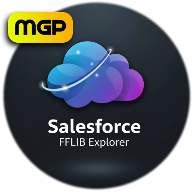

# Salesforce FFLIB Explorer

<div align="center">



**A powerful Visual Studio Code extension for managing FFLIB architecture in Salesforce projects**

[](https://marketplace.visualstudio.com/items?itemName=MiguelPunzal.salesforce-fflib-explorer)
[](https://marketplace.visualstudio.com/items?itemName=MiguelPunzal.salesforce-fflib-explorer)
[](https://opensource.org/licenses/MIT)

[Features](#-features) • [Installation](#-installation) • [Usage](#-usage) • [Documentation](docs/USAGE.md)

</div>

---

## 🎯 What is FFLIB Explorer?

FFLIB Explorer transforms how you work with the **FinancialForce Apex Library (FFLIB)** framework in Salesforce. It provides an intuitive visual interface to navigate, create, and manage your FFLIB architecture layers directly from VS Code.

### Interactive Tree View Preview

<details open>
<summary>Click to expand/collapse the tree view simulation</summary>

```
FFLIB EXPLORER
│
└─ 📦 Applications (2)
   │
   ├─ 🔷 BankApplication
   │  ├─ 🔧 Services (2)
   │  │  ├─ ➕ Create New Service
   │  │  ├─ 📄 IAccountTransferService
   │  │  │  ├─ 📄 IAccountTransferService (interface)
   │  │  │  └─ 📄 AccountTransferServiceImpl (implementation)
   │  │  └─ 📄 IPaymentProcessingService
   │  │     ├─ 📄 IPaymentProcessingService (interface)
   │  │     └─ 📄 PaymentProcessingServiceImpl (implementation)
   │  │
   │  ├─ 🏗️ Domains (1)
   │  │  ├─ ➕ Create New Domain
   │  │  └─ 📄 AccountsDomain
   │  │
   │  ├─ 🔍 Selectors (2)
   │  │  ├─ ➕ Create New Selector
   │  │  ├─ 📄 IAccountsSelector
   │  │  │  ├─ 📄 IAccountsSelector (interface)
   │  │  │  └─ 📄 AccountsSelectorImpl (implementation)
   │  │  └─ 📄 ITransactionsSelector
   │  │     ├─ 📄 ITransactionsSelector (interface)
   │  │     └─ 📄 TransactionsSelectorImpl (implementation)
   │  │
   │  └─ 💾 Unit of Work
   │     ├─ ➕ Register SObjects
   │     └─ 📋 Registered SObjects:
   │        ├─ Account
   │        ├─ Transaction__c
   │        └─ Payment__c
   │
   └─ 🔷 LoanApplication
      ├─ 🔧 Services (1)
      │  ├─ ➕ Create New Service
      │  └─ 📄 ILoanApprovalService
      │     ├─ 📄 ILoanApprovalService (interface)
      │     └─ 📄 LoanApprovalServiceImpl (implementation)
      │
      ├─ 🏗️ Domains (2)
      │  ├─ ➕ Create New Domain
      │  ├─ 📄 LoansDomain
      │  └─ 📄 ApplicantsDomain
      │
      ├─ 🔍 Selectors (1)
      │  ├─ ➕ Create New Selector
      │  └─ 📄 ILoansSelector
      │     ├─ 📄 ILoansSelector (interface)
      │     └─ 📄 LoansSelectorImpl (implementation)
      │
      └─ 💾 Unit of Work
         ├─ ➕ Register SObjects
         └─ 📋 Registered SObjects:
            ├─ Loan__c
            └─ Applicant__c
```

**🎬 Actions available:**
- Click any class name → Opens in editor
- Click ➕ buttons → Creates new class with templates
- Click Application → Auto-expands layers
- Right-click missing class → Retrieve from org

</details>

---

## ✨ Features

---

## ✨ Features

### 🎨 **Smart Auto-Creation**
When you create a **Service** or **Selector**, the extension automatically generates:
- ✅ **Interface** (e.g., `IAccountTransferService`)
- ✅ **Base Class** (e.g., `AccountTransferService`) with factory methods
- ✅ **Implementation** (e.g., `AccountTransferServiceImpl`)
- ✅ **Auto-Registration** in Application's factory
- ✅ **Proper Application Context** (e.g., `BankApplication.Service.newInstance()`)

### 📊 **Visual Architecture Explorer**
### 📊 **Visual Architecture Explorer**
- **Tree View Interface**: Browse FFLIB layers in a clean, hierarchical view
- **Application-Centric**: See all Applications and their layers at a glance
- **Layer Categories**: Services, Domains, Selectors, and Unit of Work
- **Missing Class Detection**: Warnings for registered but missing classes
- **One-Click Retrieval**: Download missing classes from org

### 🚀 **Performance Optimized**
- **Multi-Level Caching**: Lightning-fast navigation
- **Lazy Loading**: Only loads data when needed
- **Smart Scanning**: Efficient workspace analysis

### ⚡ **Quick Class Creation**
- **📱 Create Application**: Scaffold complete FFLIB Application
- **🔧 Create Service**: Interface + Base + Implementation (3 files)
- **🏗️ Create Domain**: Domain class with trigger handlers
- **🔍 Create Selector**: Interface + Base + Implementation (3 files)
- **💾 Create Unit of Work**: Multi-select SObject registration

### � **Developer Experience**
- **Loading Indicators**: Visual feedback during operations
- **Smart Placeholders**: Generic examples (BankApplication, AccountTransferService)
- **Quick Open**: Open Interface, Base, or Implementation after creation
- **Auto-Refresh**: Tree updates automatically after file changes

---

## 🚀 Installation

### From VS Code Marketplace

1. Open VS Code
2. Press `Ctrl+Shift+X` (Windows/Linux) or `Cmd+Shift+X` (Mac)
3. Search for **"Salesforce FFLIB Explorer"**
4. Click **Install**

### From Command Line

```bash
code --install-extension MiguelPunzal.salesforce-fflib-explorer
```

---

## 📖 Usage

### 1️⃣ **Opening FFLIB Explorer**

The extension activates automatically when you open a Salesforce project.

**Access the tree view:**
- Click the **📦 FFLIB Explorer** icon in the Activity Bar (left sidebar)
- Or use Command Palette: `Ctrl+Shift+P` → "FFLIB: Refresh"

### 2️⃣ **Creating a New Service**

```
1. Expand your Application (e.g., BankApplication)
2. Expand "Services"
3. Click "➕ Create New Service"
4. Enter name: "AccountTransferService"
5. ✅ Creates 3 files:
   - IAccountTransferService.cls (interface)
   - AccountTransferService.cls (base with factory method)
   - AccountTransferServiceImpl.cls (implementation)
6. ✅ Automatically registers in BankApplication
```

**Generated factory method:**
```apex
private static IAccountTransferService service() {
    return (IAccountTransferService) BankApplication.Service
        .newInstance(IAccountTransferService.class);
}
```

### 3️⃣ **Creating a New Selector**

```
1. Expand your Application
2. Expand "Selectors"  
3. Click "➕ Create New Selector"
4. Enter name: "AccountsSelector"
5. Enter SObject: "Account"
6. ✅ Creates 3 files + Auto-registers
```

### 4️⃣ **Creating a New Domain**

```
1. Expand your Application
2. Expand "Domains"
3. Click "➕ Create New Domain"
4. Enter name: "AccountsDomain"
5. Enter SObject: "Account"
6. ✅ Creates domain with trigger handlers
```

### 5️⃣ **Registering Unit of Work SObjects**

```
1. Expand your Application
2. Click "Unit of Work"
3. Click "➕ Register SObjects"
4. Multi-select SObjects from org:
   ☑ Account
   ☑ Contact
   ☑ Opportunity
5. ✅ Auto-registered in proper DML order
```

---

## 🏗️ FFLIB Architecture

This extension follows the **FFLIB Enterprise Patterns** framework:

| Layer | Purpose | Responsibilities |
|-------|---------|------------------|
| **Application** | Dependency Injection | Factory configuration, wiring implementations |
| **Service** | Multi-Object Logic | Orchestration, complex processes, transactions |
| **Domain** | Single-Object Logic | Validation, business rules, trigger handlers |
| **Selector** | Data Access | SOQL queries, FLS enforcement, query optimization |
| **Unit of Work** | Data Persistence | DML operations, transaction management, relationships |

### 📐 **Design Principles**

✅ **Separation of Concerns**: Each layer has distinct responsibilities  
✅ **Testability**: Interface-based design enables mocking  
✅ **Maintainability**: Consistent patterns across codebase  
✅ **Scalability**: Organized structure for enterprise applications  

---

## 📁 Project Structure Detection

The extension automatically detects these Salesforce project structures:

```
✅ force-app/main/default/classes/  (SFDX)
✅ src/classes/                     (Metadata API)
✅ classes/                         (Legacy)
```

---

## 🎨 Class Naming Conventions

| Layer | Convention | Examples |
|-------|-----------|----------|
| **Application** | `*Application` | `BankApplication`, `LoanApplication` |
| **Service** | `*Service`, `*ServiceImpl` | `AccountTransferService`, `PaymentProcessingServiceImpl` |
| **Domain** | `*Domain`, `*Domains` | `AccountsDomain`, `LoanDomain` |
| **Selector** | `*Selector`, `*Selectors` | `AccountsSelector`, `LoanSelector` |
| **Unit of Work** | `*UnitOfWork` | `BankUnitOfWork` |

---

## 🛠️ Extension Commands

| Command | Description |
|---------|-------------|
| `fflib.refresh` | Refresh FFLIB Explorer view |
| `fflib.createApplication` | Create new Application class |
| `fflib.createService` | Create Service (Interface + Base + Impl) |
| `fflib.createDomain` | Create Domain class |
| `fflib.createSelector` | Create Selector (Interface + Base + Impl) |
| `fflib.createUnitOfWork` | Register SObjects in Unit of Work |
| `fflib.openFile` | Open class file in editor |
| `fflib.retrieveClass` | Retrieve missing class from org |

---

## 📚 Resources

- 📖 [FFLIB Framework Documentation](https://docs.goharrier.com/technical/frameworks/fflib-apex-framework)
- 💻 [FFLIB GitHub Repository](https://github.com/apex-enterprise-patterns/fflib-apex-common)
- 🎓 [Salesforce DX Developer Guide](https://developer.salesforce.com/docs/atlas.en-us.sfdx_dev.meta/sfdx_dev/)
- 📘 [Extension Documentation](docs/USAGE.md)

---

## 🤝 Contributing

Contributions are welcome! Please feel free to submit a Pull Request.

1. Fork the repository
2. Create your feature branch (`git checkout -b feature/AmazingFeature`)
3. Commit your changes (`git commit -m 'Add some AmazingFeature'`)
4. Push to the branch (`git push origin feature/AmazingFeature`)
5. Open a Pull Request

---

## 📝 Changelog

### 1.0.1 (Latest)
- ✅ Fixed repository URL
- ✅ Updated documentation

### 1.0.0
- ✅ Initial release
- ✅ Tree view explorer for FFLIB architecture
- ✅ Auto-creation with Interface + Base + Implementation
- ✅ Auto-registration in Application factories
- ✅ Multi-select SObject picker for Unit of Work
- ✅ Performance optimization with multi-level caching
- ✅ Missing class detection and retrieval
- ✅ Loading progress indicators

---

## 📄 License

MIT License - See [LICENSE](LICENSE.txt) file for details

---

## ⭐ Show Your Support

If you find this extension helpful, please:
- ⭐ Star the [GitHub repository](https://github.com/miguelgpunzal/sfdx-fflib-explorer)
- 📝 Leave a review on the [VS Code Marketplace](https://marketplace.visualstudio.com/items?itemName=MiguelPunzal.salesforce-fflib-explorer)
- 🐛 Report issues or suggest features

---

<div align="center">

**Built with ❤️ for the Salesforce Community**

[Report Bug](https://github.com/miguelgpunzal/sfdx-fflib-explorer/issues) • [Request Feature](https://github.com/miguelgpunzal/sfdx-fflib-explorer/issues) • [Documentation](docs/USAGE.md)

</div>
